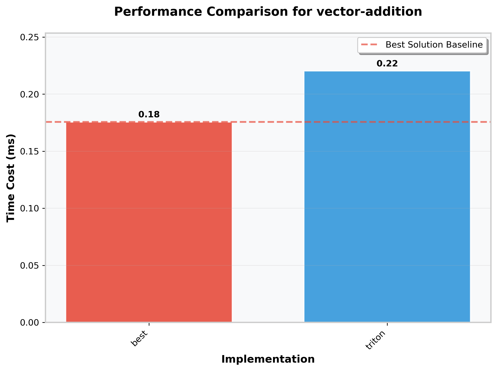
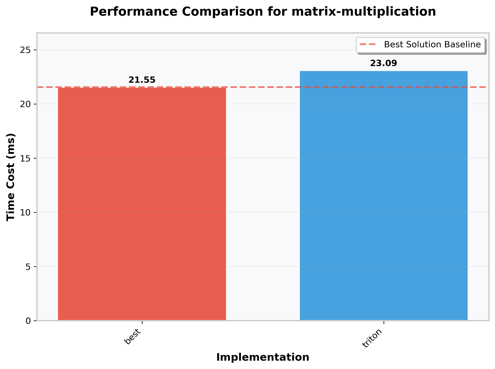
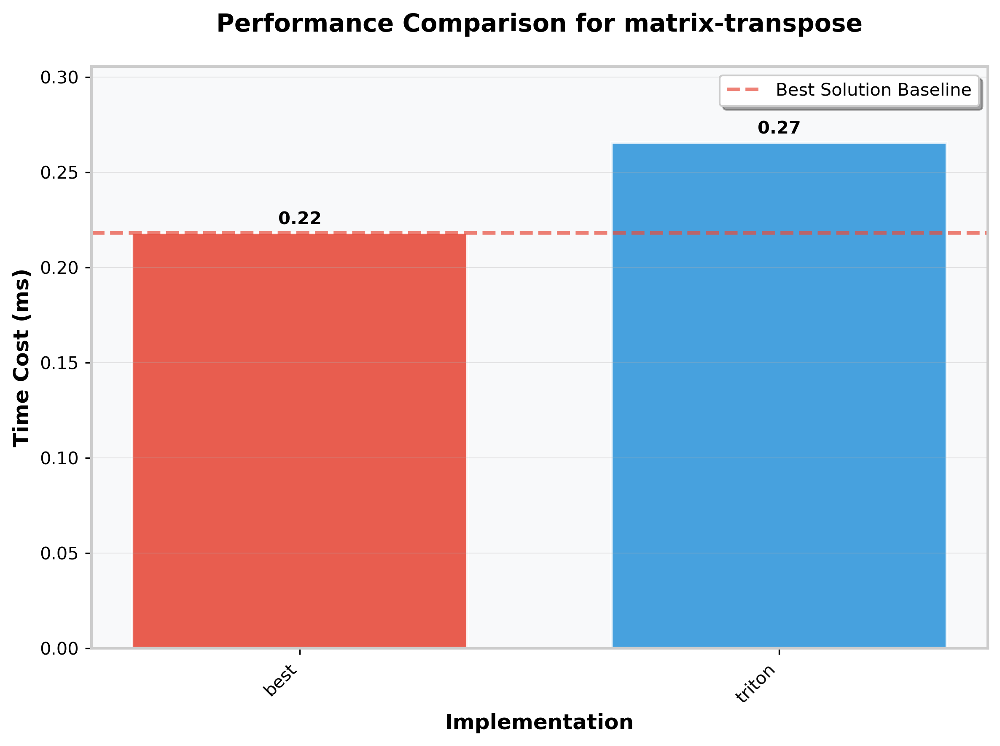
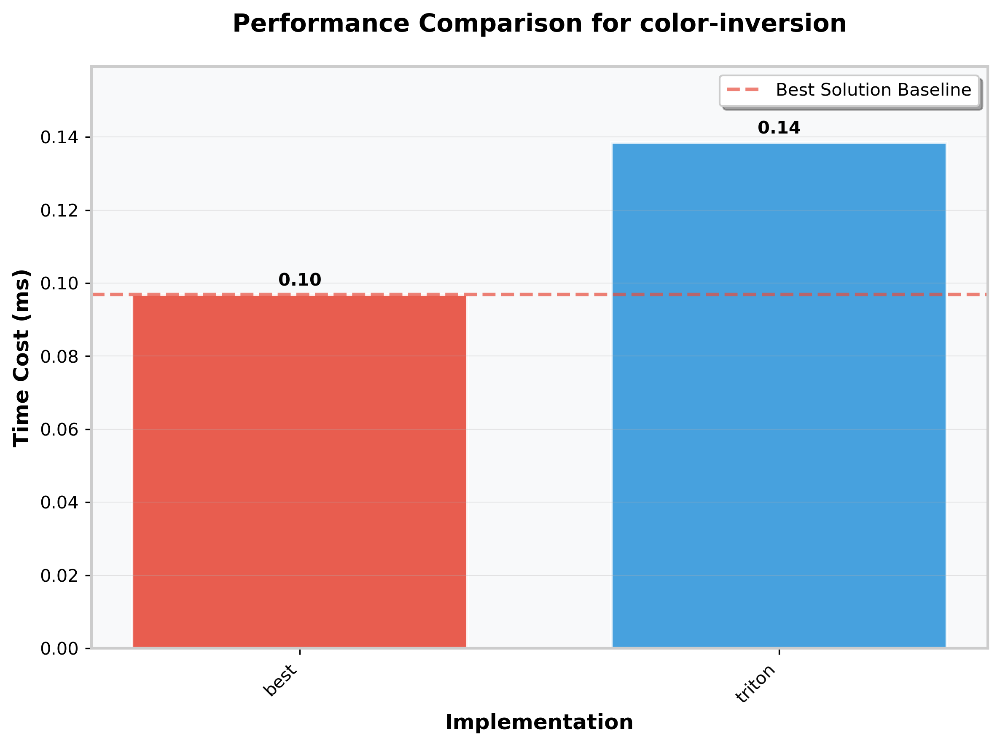
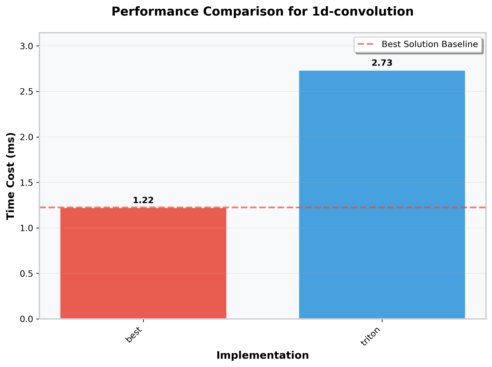
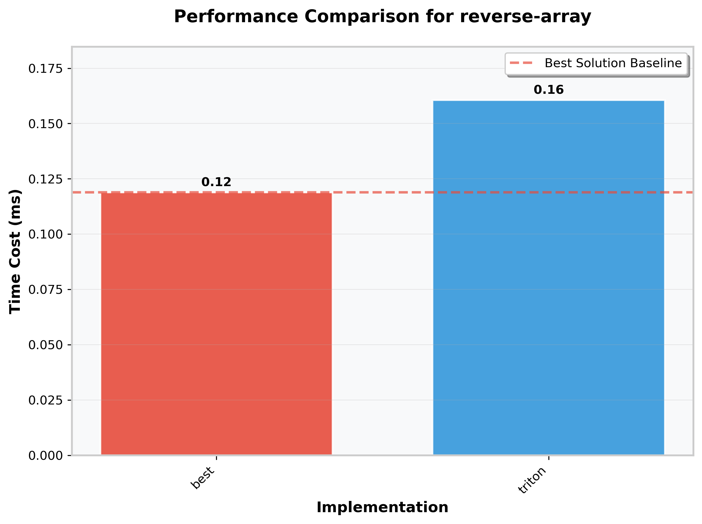
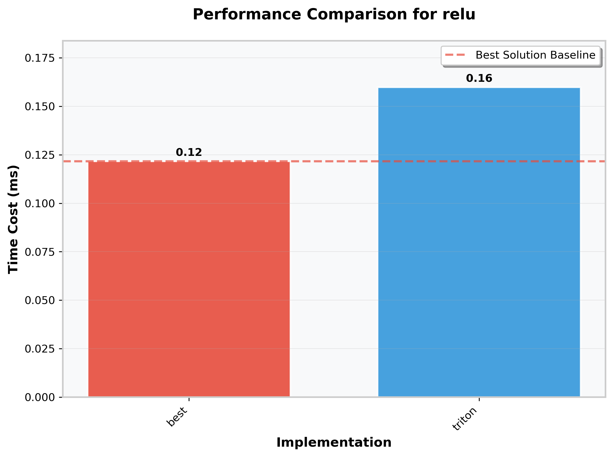
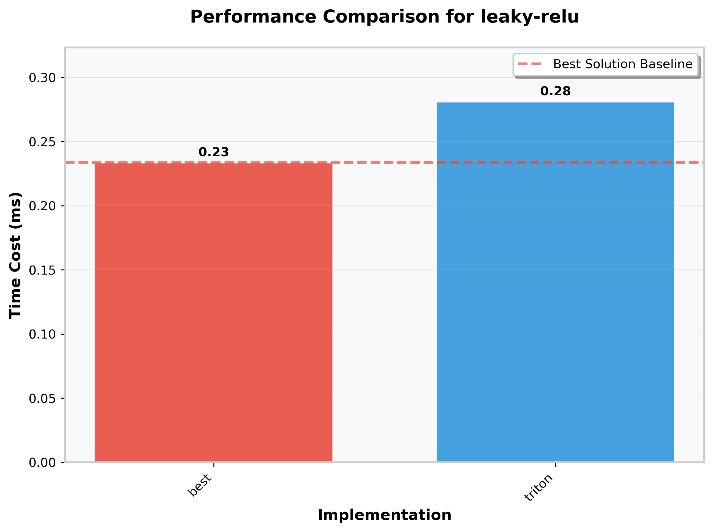
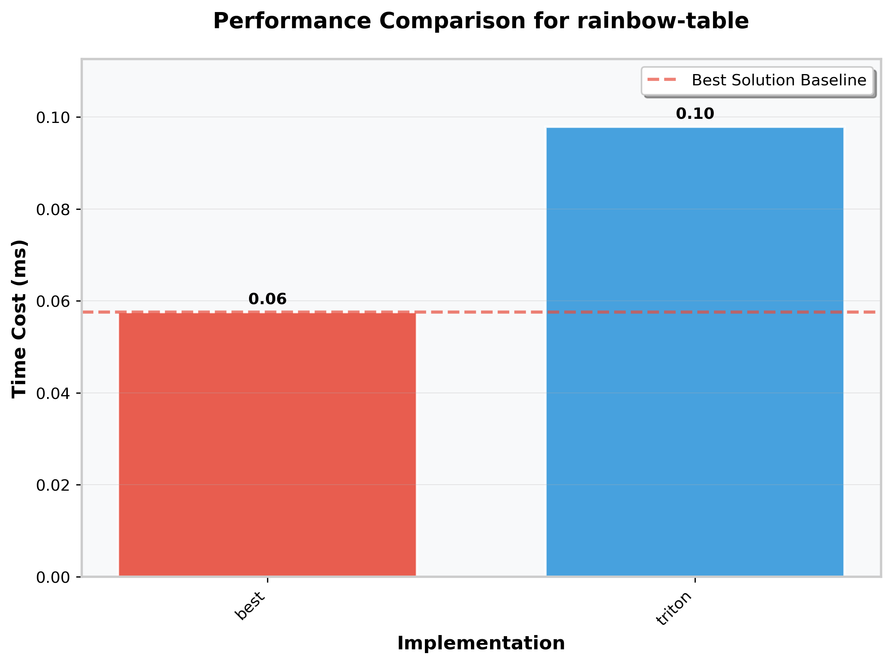

# LeetgpuSolution

Personal Triton GPU kernels that solve a handful of LeetGPU practice problems. Each solution keeps the problem-focused entry point exposed as a `solve(...)` function so you can plug the kernels into the LeetGPU grader or reuse them locally for benchmarking.

# Perf benchmark

## NVIDIA A100-80GB

### vector-addition

### matrix-multiplication

### matrix-transpose

### color-inversion

### 1d-convolution

### reverse-array

### relu

### leaky-relu

### rainbow-table

